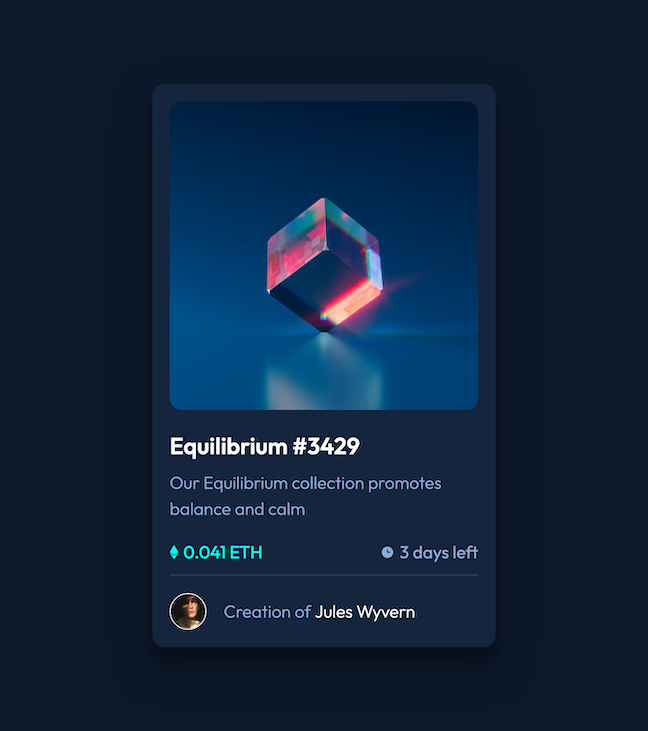

# NFT preview card

This is a solution to the [NFT preview card component challenge on Frontend Mentor](https://www.frontendmentor.io/challenges/nft-preview-card-component-SbdUL_w0U). Frontend Mentor challenges help you improve your coding skills by building realistic projects.

## Overview

### Screenshot

### Links

- Solution URL: [Frontend_Mentor](https://)
- Live Site URL: [GitHub](https://heygilly.github.io/NFT-preview-card/)

## My process

### Built with

- Semantic HTML5 markup
- CSS custom properties
- Flexbox
- CSS Grid
- Mobile-first workflow
- [SASS](https://sass-lang.com/) - CSS library

### What I learned
- Getting familiar with Sass and Vite 

## Author
- LinkedIn - [@HeyGilly](https://www.linkedin.com/in/heygilly/)
- Frontend Mentor - [@HeyGilly](https://www.frontendmentor.io/profile/HeyGilly)
